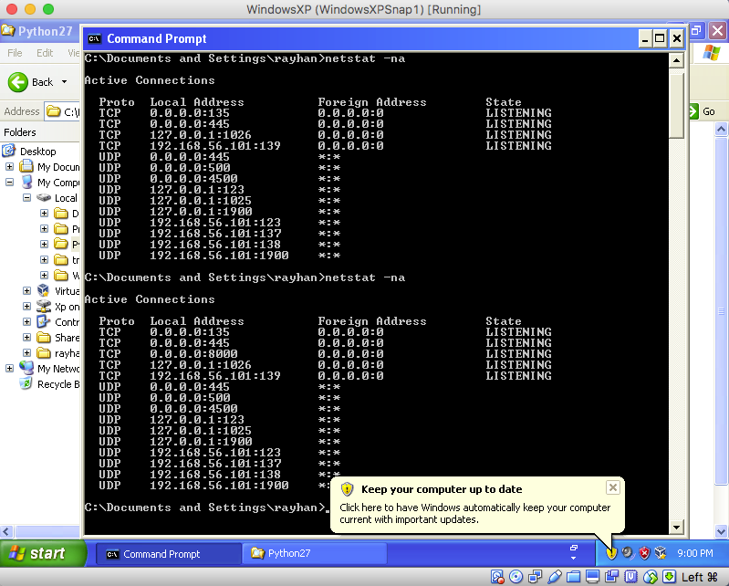
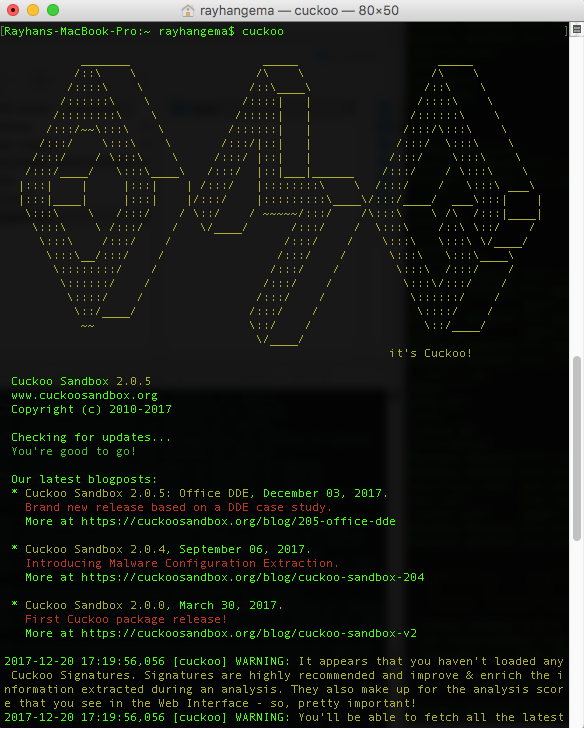
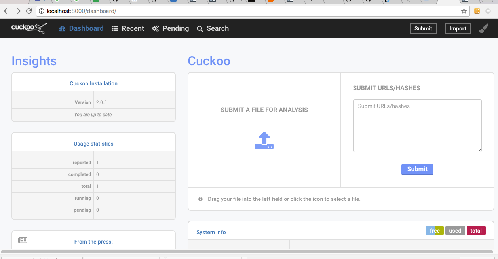
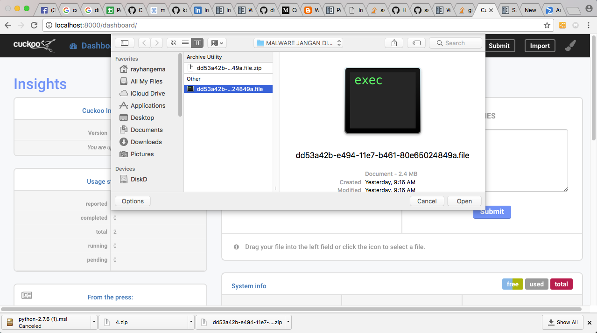
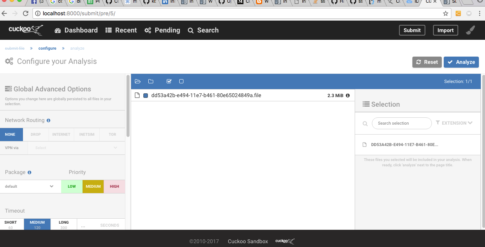
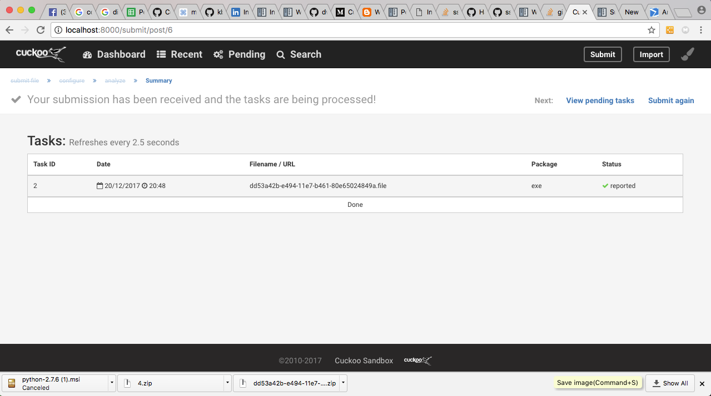
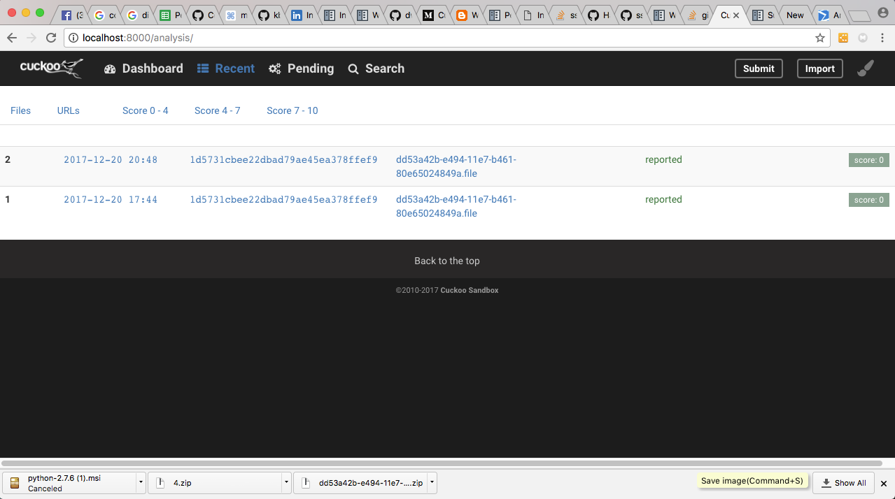
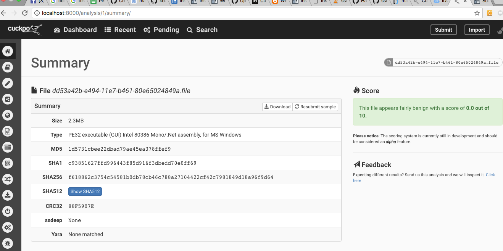
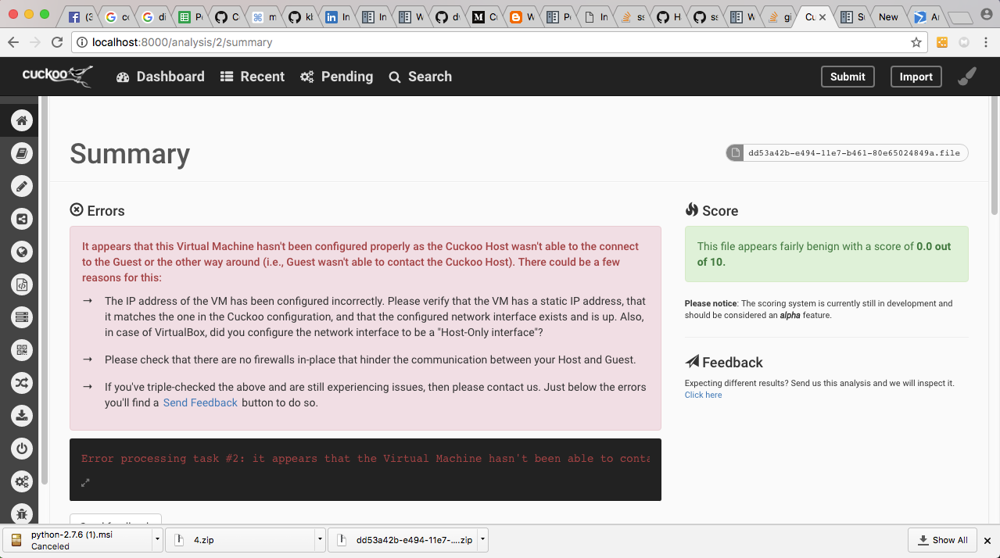

Laporan PKSJ Cuckoo

### Pendahuluan 

Malware (Malicious Software) adalah suatu program yang dirancang dengan tujuan untuk merusak dengan menyusup ke sistem komputer. Malware dapat menginfeksi banyak komputer dengan masuk melalui email, download internet, atau program yang terinfeksi.
Malware bisa menyebabkan kerusakan pada sistem komputer dan memungkinkan juga terjadi pencurian data / informasi. Hal yang pada umumnya terjadi penyebab malware adalah mendownload software dari tempat ilegal yang disisipan malware. Malware mencakup virus, worm, trojan horse, sebagian besar rootkit, spyware, adware yang tidak jujur, serta software-software lain yang berbahaya dan tidak diinginkan oleh pengguna PC.
Pada website sendiri terkadang bisa terjangkit malware, hal ini bisa terjadi jika pengguna melakukan download theme website secara ilegal, hal itu dapat menyebabkan data dan informasi yang ada di website jebol, terkadang juga bisa menyebabkan server website menjadi down karena aktifitas yang mencurigakan tersebut.
Malware sendiri sudah menjadi suatu target riset untuk para security analysis dan juga para hacker maka dari itu diperlukan suatu software untuk mendeteksi behavior dan juga laporan terhadap suatu file apakah file tersebut mengandung malware atau tidak. software tersebut adalah Cuckoo


### Dasar Teori 
#### Cukoo 

Cuckoo dapat digunakan untuk melakukan analisa malware dan memberi report secara otomatis apa saja yang dilakukan malware terhadap komputer. Malware akan dijalankan dalam sebuah sandbox yang menggunakan os Windows. Cuckoo dapat melakukan analisa terhadap berbagai macam sampel malware. Beberapa jenis file yang dapat dianalisa dengan cuckoo diantaranya:
•     File exe (Generic Windows executables)
•     file DLL files
•     dokumen PDF
•     dokumen Microsoft Office
•     Halaman Web
•     Script PHP
•     dll
Setelah dijalankan cuckoo akan melaporkan hasil analisa malware. Hasil analisa yang dilaporkan diantaranya:
	•	API calls apa saja yang dijalankan malware
	•	File apa saja yang dibuat,
	•	File apa saja yang dihapus
	•	File apa saja yang diunduh malware
	•	Aktifitas malware di memori (memory dumps)
	•	Trafik jaringan yang diakses malware (dalam format PCAP)
	•	Screenshot desktop windows selama malware dijalankan
	•	dll
Cuckoo bisa berjalan pada berbagai distro Linux. Tools ini open source, disupport oleh komunitas. 

### Instalasi

Requirements:
```
Mac OS Sierra 10.2.3
Homebrew sudah di install , Homebrew dapat di instal dengan:
/usr/bin/ruby -e "$(curl -fsSL https://raw.githubusercontent.com/Homebrew/install/master/install)"
Virtual Box Sudah terinstall
Python dengan versi terbaru
mongodb sudah terinstalasi
```

1. Install Dependensies untuk python yaitu
```
sudo easy_install pip
pip install python-magic
brew install libmagic
sudo pip install dpkt-fix
sudo pip install mako
```

2. Konifgurasi tcpdump

Dikarenakan mac memiliki SIP (System Integrity Protection) maka jika kita akan mengatur SIPnya dengan 
	⁃	Masuk ke system recovery mac, yaitu dengan restart lalu tekan command + r
	⁃	Kemudian masuk ke terminal dan masukan command csrlutil disable, kemudian restart
	⁃	lalu masukan chmod +s /usr/sbin/tcpdump di terminal

3. Instalasi Windows XP di Virtual box

instalasi windows xp sebagai berikut:
	⁃	Klik new di Interface Virtualbox
	⁃	Masukan nama operating systemnya contoh “WindowsXP” , type microsoft windows, untuk versionnya windows XP 32 bit, continue
	⁃	atur memory size 512 mb atau bebas
	⁃	kemudian pilih create a virtual hard disk now dan pilih create.
	⁃	lalu masukan file iso dengan klik kanan lalu setting di VM yang sudah kita buat
	⁃	pilih storage lalu pilih di storage treenya pilihan empty kemudian pilih iso dari WindowsXPnya melalui tombol CD untuk memilih isonya
	⁃	start VMnya kemudian instal windows XP seperti biasa
	⁃	setelah win xp sudah terinstall setting network dari VM WinXp dengan bridged Adaptor
	⁃	download dan Install python 2.7 https://www.python.org/ftp/python/2.7.6/python-2.7.6.msi
	⁃	download dan install PIL (http://effbot.org/downloads/PIL-1.1.7.win32-py2.7.exe)
	⁃	Install software lainnya seperti Firefox dan sebagainya

4. Instalasi Cuckoo
untuk menginstal cuckoo dengan menuliskan command
	``` pip install -U cuckoo ``` 

###Konfigurasi

1. Setting Network di VM Windows XP menjadi Host-Only Adapter dan name pilih vboxnet0 , kemudian pilih Advanced dan pilih Adapter Type menjadi PCnet-FAST III (Am79C973) refresh mac address dan start VM Windows XPnya

2. Copy agent dari Host (Mac) di .cuckoo/agent/agent.py ke VM (WindowsXP) di directory C:\Python27\"

3. Rename agent.py menjadi agent.pyw

4. klik dua kali untuk menjalankan agent.pyw

5. untuk melihat apakah agent sudah dimulai gunakan command dibawah ini di command prompt WinXP
		``` netstat -na ```
	lalu lihat apakah ada socket yang listening di port 0.0.0.0:8000


5. Kemudian ambil snapshot dengan menggunakan command berikut di terminal mac
	```vboxmanage snapshot "WindowsXP" take "WindowsXPsnap1” --pause ```
	dengan ketentuan “WindowsXP” merupakan nama VM yang anda namakan di VM WInXP yang dibuat
6. Setelah di snapshot anda bisa merestore snapshotnya dengan 3 command dibawah ini
	```
 	 vboxmanage controlvm "WindowsXPVM1" poweroff  
 	 vboxmanage snapshot "WindowsXPVM1" restorecurrent  
 	 vboxheadless --startvm "WindowsXPVM1"  
	``` 

7. Kemudian setting virtualbox.conf di .cuckoo/conf/virtualbox.conf sesuai dengan configurasi dibawah
```[virtualbox]  
  # Specify which VirtualBox mode you want to run your machines on.  
  # Can be "gui", "sdl" or "headless". Refer to VirtualBox's official  
  # documentation to understand the differences.  
  mode = headless  
  # Path to the local installation of the VBoxManage utility.  
  path = /usr/bin/VBoxManage  
  # Specify a comma-separated list of available machines to be used. For each  
  # specified ID you have to define a dedicated section containing the details  
  # on the respective machine. (E.g. cuckoo1,cuckoo2,cuckoo3)  
  machines = WindowsXP 
  [WindowsXP]  
  # Specify the label name of the current machine as specified in your  
  # VirtualBox configuration.  
  label = WindowsXP
  # Specify the operating system platform used by current machine  
  # [windows/darwin/linux].  
  platform = windows  
  # Specify the IP address of the current machine. Make sure that the IP address  
  # is valid and that the host machine is able to reach it. If not, the analysis  
  # will fail.  
  ip = 192.168.56.101
```
8. seting enable yes di bagian mongodb dalam reporting.conf
```
# Enable or disable the available reporting modules [on/off].
# If you add a custom reporting module to your Cuckoo setup, you have to add
# a dedicated entry in this file, or it won't be executed.
# You can also add additional options under the section of your module and
# they will be available in your Python class.

[feedback]
# Automatically report errors that occurred during an analysis. Requires the
# Cuckoo Feedback settings in cuckoo.conf to have been filled out properly.
enabled = no

[jsondump]
enabled = yes
indent = 4
calls = yes

[singlefile]
# Enable creation of report.html and/or report.pdf?
enabled = no
# Enable creation of report.html?
html = no
# Enable creation of report.pdf?
pdf = no

[misp]
enabled = no
url =
apikey =

# The various modes describe which information should be submitted to MISP,
# separated by whitespace. Available modes: maldoc ipaddr hashes url.
mode = maldoc ipaddr hashes url

[mongodb]
enabled = yes
host = 127.0.0.1
port = 27017
db = cuckoo
store_memdump = yes
paginate = 100
# MongoDB authentication (optional).
username =
password =
```

9. Jalankan cuckoo di tab terminal pertama dengan perintah
```
cuckoo
``` 


10. Jalankan Web cuckoo dengan menggunakan perintah
```
cuckoo web runserver 0.0.0.0:8000
```

11. buka localhost:8000 dari host maka akan muncul seperti gambar berikut


###Testing Malware

Setelah kita menginstall dan mengkonfigurasi Cuckoo berikut adalah salah satu testing untuk malware

1.Buka localhost:8000 dan akan terlihat tampilan seperti berikut ini 


2. Kemudian Upload malware yang akan di uji disini diambil contoh adalah dd53a42b-e494-11e7-b461-80e65024849a.exe dengan link dari virustotal adalah https://www.virustotal.com/en/file/f618862c3754c54581b0db78cb46c788a27104422cf42c7981849d18a96f9d64/analysis/1513550977/

3. Upload malware

4. Setelah malware di upload akan muncul halaman berikut lalu klik analyze


5. maka akan muncul digambar berikut 


6. untuk melihat hasil analisa ada di menu recent lalu pilih kegiatan scan yang mana yang aka di lihat hasilnya 


7. lalu akan muncul summary hasil scan

